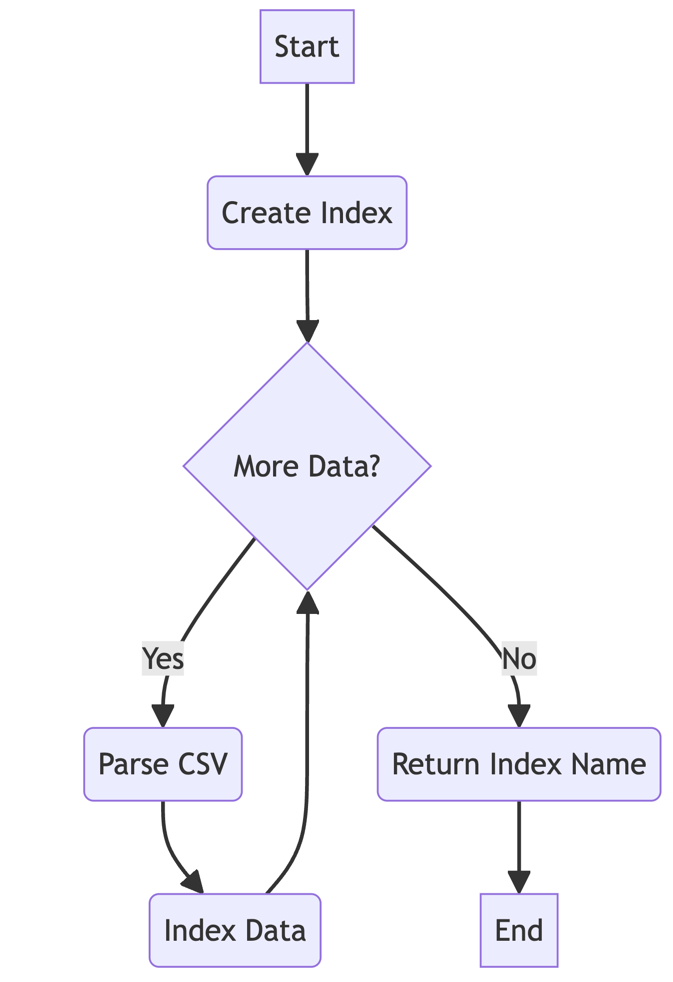

# FastDataSearch
FastDataSearch is like a high-powered search engine for your big data collections. Imagine you have massive csv file full of information, and you want to be able to find exactly what you need quickly and easily. That's where FastDataSearch comes in.

- FastDataSearch is built using Java Spring Boot.

- Here's what it does in simpler terms:
  
  1. It takes your large data files (like giant CSV spreadsheets) and cleverly organizes them in a special database called `Elasticsearch`. This is like creating a super-efficient filing system for your data.
  2. Once your data is organized, you can search through it really fast. It's similar to how Google lets you find things on the internet quickly, but for your own data.
  3. You can ask FastDataSearch questions about your data with query similar to SQL AND opertaion and it will fetch that information for you in a snap.
  4. It's smart about handling huge amounts of data. Instead of trying to work with everything at once (which would be slow), it breaks things into manageable chunks.
   
The big benefit is speed and efficiency. If you're a business dealing with tons of data, FastDataSearch helps you find what you need without waiting around. It's like having a super-fast plus smart assistant that knows exactly where everything is in your massive digital filing cabinet.

## Code Flow


<p>



</p>

### Postman collection - [FastDataSearch APIs](https://www.postman.com/lunar-module-geologist-7953428/workspace/fastdatasearch/collection/36590837-58db379f-3bcb-4277-8f20-dc39e89e8d7a)


## Installation 

1. Clone the repository:
   ```sh
   git clone https://github.com/your-repo/FastDataSearch.git
   cd FastDataSearch
   ```
2. Configure Elasticsearch in `application.properties`:
   ```properties
   spring.application.name=FastDataSearch
   spring.data.elasticsearch.cluster-name=FastDataSearchCluster
   spring.data.elasticsearch.cluster-nodes=localhost:9200
   spring.data.elasticsearch.repositories.enabled=true

   # Maximum upload file size
   spring.servlet.multipart.max-file-size=100MB
   spring.servlet.multipart.max-request-size=100MB
   ```
3. Build the project:
   ```sh
   mvn clean install
   ```
4. Run the application:
   ```sh
   mvn spring-boot:run
   ```

## APIs information

### 1. Upload dataset (CSV file)
**Endpoint:** `/api/index`  
**Method:** `POST`  
**Description:** Uploads a CSV file and indexes its data into Elasticsearch.

**cURL Command:**
```sh
curl -X POST 'http://localhost:8080/api/index' 
  -H "Content-Type: multipart/form-data" 
```
select `form-data` in Body and make a `key` named file with type `File` and upload csv in its `value`.

**Response:**
  ```json
  {
    "message": "Data ingested successfully",
    "index": "indexName"
  }
  ```

### 2. List All Datasets
**Endpoint:** `/api/index`  
**Method:** `GET`  
**Description:** Lists all available datasets (indices) in Elasticsearch.

**cURL Command:**
```sh
curl -X GET 'http://localhost:8080/api/index'
```

**Response:**
  ```json
  {
    "datasets": [
      "index1", 
      "index2", 
      "index3"
    ]
  }
  ```

### 3. List All Columns
**Endpoint:** `/api/index/{indexName}`  
**Method:** `GET`  
**Description:** Shows the columns (fields) of a specific dataset (index).

**cURL Command:**
```sh
curl -X GET 'http://localhost:8080/api/index/{indexName}'
```

**Response:**

  ```json
  {
    "columns": [
      "column1", 
      "column2", 
      "column3"
    ]
  }
  ```

### 4. List Full Dataset
**Endpoint:** `/api/index/{indexName}/search`  
**Method:** `GET`  
**Description:** List all the data in associated with an index in Elasticsearch.
**cURL Command:**
```sh
curl -X GET 'http://localhost:8080/api/index/{indexName}/search' 
```

**Response:**
  ```json
  {
    "results": [
      {
        "column1": "value1",
        "column2": "value2",
        "column3": "value3"
      },
      {
        "column1": "value4",
        "column2": "value5",
        "column3": "value6"
      },
      {
        "column1": "value7",
        "column2": "value8",
        "column3": "value9"
      }
    ]
  }
  ```


### 5. Query Dataset
**Endpoint:** `/api/index/{indexName}/search/{query}`  
**Method:** `GET`  
**Description:** Queries a specific dataset (index) with given criteria and returns a list of data satisfying the query.

**cURL Command:**
```sh
curl -X GET 'http://localhost:8080/api/index/{indexName}/search?col1=abc&col2=xyz' 
```

**Response:**
  ```json
  {
    "results": [
      {
        "column1": "value1",
        "column2": "value2",
        "column3": "value3"
      },
      {
        "column1": "value4",
        "column2": "value5",
        "column3": "value6"
      }
    ]
  }
  ```
